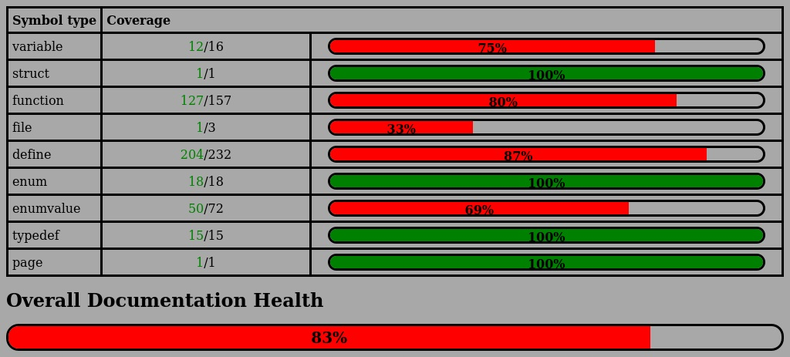

## Summary
Platform independent driver for the NRF24L01(+) complient with ANSI C99. Tested on the ESP32 using ESP-IDF release/v4.3

## Documentation
Driver documentation generated by Doxygen is available [here](https://jarpoole.github.io/NRF24L01_driver/)  

Documentation health is updated on commit:

## Inspiration
To my knowledge, a platform-independent driver for the NRF24L01(+) is not available although there are plenty of samples on Arduino.
Based on code provided at https://github.com/elmot/nrf24l01-lib and https://github.com/LonelyWolf/stm32/tree/master/nrf24l01
